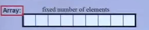
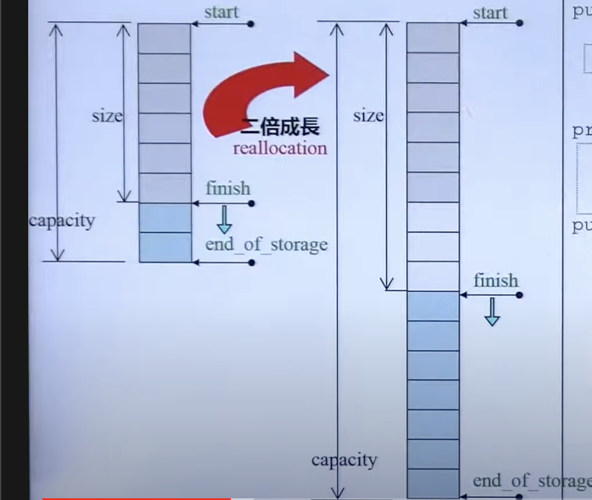
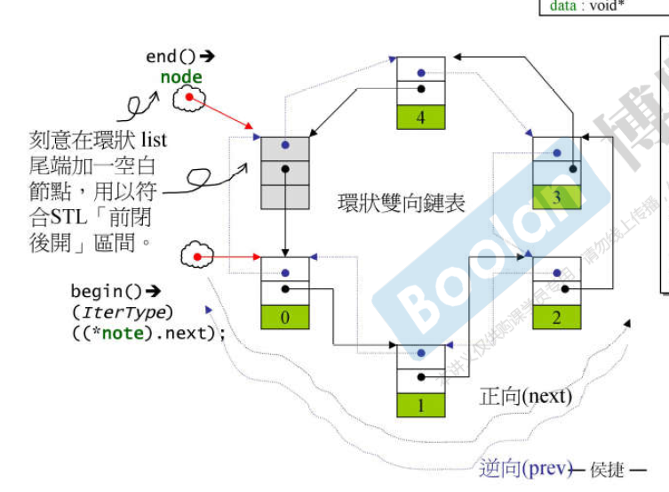

# Containers

## General:

- [  ) 前闭后开 
- It doesnt have to be continued

## Array
- C++ 11 Feature
- size is set, cannot be changed
- Continue in memory space (连续的)
- 

## Vector
- Continue in memory space (连续的)
- 12 byte in total, contains only 3 pointers:
  1. start
  2. finish
  3. end_of_storage
- When run out of size -> double the size by re-allocation (a lot of **copy()** are called)
- 

## List

- doublely-linked list
- Iterator 为了模拟smart pointer的行为，所有在list 里需要重载 (list的node在memory里是不连续的)
- 

## Queue, Stack, Deque

## Map, Set
- Built by [Red–black tree](https://en.wikipedia.org/wiki/Red%E2%80%93black_tree)

## Unordered_Map, Unordered_Set

- Hash Map
- Seperate Chaining (by Allocator)
- Cannot use [ ] to insert