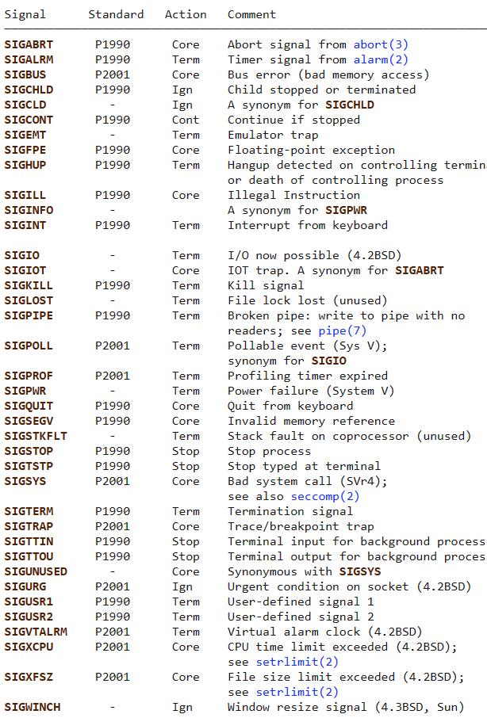

# Lecture Notes

# Lecture1: Shell

[Course overview + the shell · Missing Semester (mit.edu)](https://missing.csail.mit.edu/2020/course-shell/)

- The shell parses the command by splitting it by **`whitespace`**, and then runs the program indicated by the first word, supplying each subsequent word as an argument that the program can access
- **`#`** means under root permission
- The `|` operator lets you “chain” programs such that the output of one is the input of another
- using `cd -` you can change to your previous directory
- The simplest form of redirection is `< file` and `> file`.

# Lecture2: Shell Tools and Scripting

[Shell Tools and Scripting · Missing Semester (mit.edu)](https://missing.csail.mit.edu/2020/shell-tools/)

- use `foo=bar` instead of `foo = bar` **space** is important
- in bash script:
    - `$0` - Name of the script
    - `$1` to `$9` - Arguments to the script. `$1` is the first argument and so on.
    - `$@` - All the arguments
    - `$#` - Number of arguments
    - `$?` - Return code of the previous command
    - `$$` - Process identification number (PID) for the current script
    - `!!` - Entire last command, including arguments. A common pattern is to execute a command only for it to fail due to missing permissions; you can quickly re-execute the command with sudo by doing `sudo !!`
    - `$_` - Last argument from the last command. If you are in an interactive shell, you can also quickly get this value by typing `Esc` followed by `.` or `Alt+.`
- `( CMD )` create a temp result file from the cmd
- Wildcards - Whenever you want to perform some sort of wildcard matching, you can use `?` and `*` to match one or any amount of characters respectively.
- Curly braces `{}` - Whenever you have a common substring in a series of commands, you can use curly braces for bash to expand this automatically.
- There are tools like [**shellcheck**](https://github.com/koalaman/shellcheck) that will help you find errors in your sh/bash scripts.
- There is a tool called **tldr** helps you to have a shorter man page
- `find` is important
    
    ```bash
    # Find all directories named src
    find . -name src -type d
    # Find all python files that have a folder named test in their path
    find . -path '*/test/*.py' -type f
    # Find all files modified in the last day
    find . -mtime -1
    # Find all zip files with size in range 500k to 10M
    find . -size +500k -size -10M -name '*.tar.gz'
    ```
    
- `locate`command uses the stored database information on all the directories (everything)
    
    `updatedb` updates the above database
    

## Exercise

1. Read man ls and write an ls command that lists files in the following manner Includes all files, including hidden files:
    1. Sizes are listed in human readable format (e.g. 454M instead of 454279954)
    2. Files are ordered by recency
    3. Output is colorized
    
    ---
    
    `ls -alh --color=auto --time-style=+"%Y-%m-%d %H:%M:%S"`
    
    Explanation:
    
    - **`a`**: shows all files, including hidden files
    - **`l`**: enables long listing format
    - **`h`**: prints human-readable sizes (e.g. 454M)
    - **`-color=auto`**: enables colorized output
    - **`-time-style=+"%Y-%m-%d %H:%M:%S"`**: displays the file's timestamp in a human-readable format (YYYY-MM-DD HH:MM:SS)
2. Write bash functions `marco` and `polo` that do the following. Whenever youe xecute `marco` the current working directory should be saved in some manner, then when you execute `polo`, no matter what directory you are in, `polo` should `cd` you back to the directory where you executed `marco`. For ease of debugging you can write the code in a file `marco.sh` and (re)load the definitions to your shell by executing `source marco.sh`.
    
    ---
    
    ```bash
    marco () {
        MARCO_DIR=$(pwd)  # Save the current directory in a variable
    }
    
    polo () {
        cd "$MARCO_DIR"  # Change to the directory saved in the variable
    }
    ```
    
3. Say you have a command that fails rarely. In order to debug it you need to capture its output but it can be time consuming to get a failure run. Write a bash script that runs the following script until it fails and captures its standard output and error streams to files and prints everything at the end. Bonus points if you can also report how many runs it took for the script to fail.
    
    ```bash
    #!/usr/bin/env bash
    
     n=$(( RANDOM % 100 ))
    
     if [[ n -eq 42 ]]; then
        echo "Something went wrong"
        >&2 echo "The error was using magic numbers"
        exit 1
     fi
    
     echo "Everything went according to plan"
    ```
    
    ---
    
    ```bash
    #!/bin/bash
    
    # Initialize variables
    command=$1
    count=0
    status=0
    
    # Loop until the command fails
    while [[ $status -eq 0 ]]
    do
      # Increment counter
      (( count++ ))
    
      # Run the command and capture output and error streams to files
      output_file="output_$count.txt"
      error_file="error_$count.txt"
      bash $command > "$output_file" 2> "$error_file"
      status=$?
    
      # Print status message
      if [ $status -eq 0 ]
      then
        echo "Command succeeded on attempt $count"
      else
        echo "Command failed on attempt $count"
      fi
    done
    
    # Print output and error streams
    echo "Output streams:"
    cat output_*.txt
    echo "Error streams:"
    cat error_*.txt
    
    # Report number of runs
    echo "Ran the command $count times before it failed."
    ```
    
4. As we covered in the lecture `find`’s `-exec` can be very powerful for performing operations over the files we are searching for. However, what if we want to do something with **all** the files, like creating a zip file? As you have seen so far commands will take input from both arguments and STDIN. When piping commands, we are connecting STDOUT to STDIN, but some commands like `tar` take inputs from arguments. To bridge this disconnect there’s the `[xargs](https://www.man7.org/linux/man-pages/man1/xargs.1.html)` command which will execute a command using STDIN as arguments. For example `ls | xargs rm` will delete the files in the current directory.
    
    Your task is to write a command that recursively finds all HTML files in the folder and makes a zip with them. Note that your command should work even if the files have spaces (hint: check `-d` flag for `xargs`).
    
    ---
    
    ```bash
    find . -type f -name "*.html" -print0 | xargs -0 tar -czvf html_files.tar.gz
    ```
    
    Let's break down the command:
    
    - **`find .`**: This recursively finds all files in the current directory and its subdirectories.
    - **`type f`**: This limits the search to regular files.
    - **`name "*.html"`**: This filters the results to only include files whose names end with ".html".
    - **`print0`**: This prints the file names separated by null characters instead of newlines, which is needed for the **`xargs`** command.
    - **`|`**: This pipes the results of **`find`** to the **`xargs`** command.
    - **`xargs -0`**: This tells **`xargs`** to read the file names from STDIN and use null characters as separators.
    - **`tar -czvf html_files.tar.gz`**: This creates a tar archive with the given file names and compresses it using gzip. The **`d`** flag is not needed here because **`tar`** accepts file names as arguments, not STDIN.

# ~~Lecture3: VIM~~

# ~~Lecture4: ****Data Wrangling****~~

[Data Wrangling · Missing Semester (mit.edu)](https://missing.csail.mit.edu/2020/data-wrangling/)

- 

# Lecture5: ****Command-line Environment****

[Command-line Environment · Missing Semester (mit.edu)](https://missing.csail.mit.edu/2020/command-line/)

- Ctrl + C → `SIGINT`; CTRL + D → **`SIGQUIT`;** Ctrl + \ → `SIGQUIT`;  ****Ctrl+Z → `SIGTSTP`
    
    ```bash
    tairan-ubuntu@Tairan-PC:~/git/back-tester$ stty -a | grep -Ewoe '(intr|quit|susp) = [^;]+'
    intr = ^C
    quit = ^\
    susp = ^Z
    ```
    
- [signal(7) - Linux manual page (man7.org)](https://man7.org/linux/man-pages/man7/signal.7.html):
    
    
    
- `SIGKILL`cannot be captured by the process, so it could be harmful
- `SIGUP` hangs up the program
- Ctrl+Z → `SIGTSTP` → suspended
- add a `&` at the end of the program → run program in the background
- `nohup` → nohup - run a command immune to hangups, with output to a non-tty (so close the terminal the process will continue to run)
- **Tmux**
    
    `tmux` expects you to know its keybindings, and they all have the form `<C-b> x` where that means (1) press `Ctrl+b`, (2) release `Ctrl+b`, and then (3) press `x`. `tmux` has the following hierarchy of objects:
    
    - **Sessions** - a session is an independent workspace with one or more windows
        - `tmux` starts a new session.
        - `tmux new -s NAME` starts it with that name.
        - `tmux ls` lists the current sessions
        - Within `tmux` typing `<C-b> d` detaches the current session
        - `tmux a` attaches the last session. You can use `t` flag to specify which
    - **Windows** - Equivalent to tabs in editors or browsers, they are visually separate parts of the same session
        - `<C-b> c` Creates a new window. To close it you can just terminate the shells doing `<C-d>`
        - `<C-b> N` Go to the *N* th window. Note they are numbered
        - `<C-b> p` Goes to the previous window
        - `<C-b> n` Goes to the next window
        - `<C-b> ,` Rename the current window
        - `<C-b> w` List current windows
    - **Panes** - Like vim splits, panes let you have multiple shells in the same visual display.
        - `<C-b> "` Split the current pane horizontally
        - `<C-b> %` Split the current pane vertically
        - `<C-b> <direction>` Move to the pane in the specified *direction*. Direction here means arrow keys.
        - `<C-b> z` Toggle zoom for the current pane
        - `<C-b> [` Start scrollback. You can then press `<space>` to start a selection and `<enter>` to copy that selection.
        - `<C-b> <space>` Cycle through pane arrangements.

# Lecture6: Git

[Lecture 6: Version Control (git) (2020) - YouTube](https://www.youtube.com/watch?v=2sjqTHE0zok)