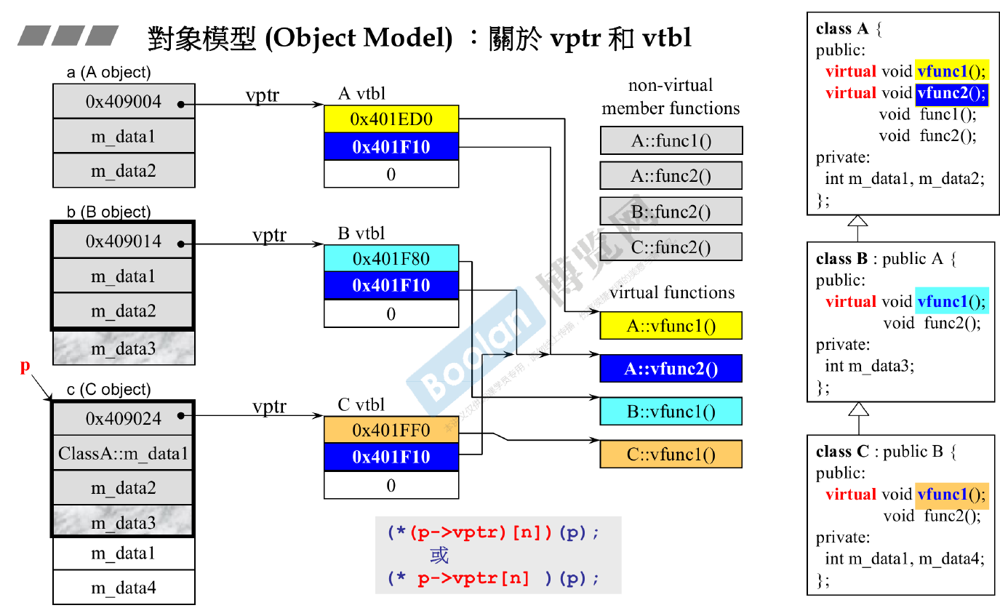

# Virtual Function

## Example:

    #include <iostream>

    // Base class
    class Shape {
    public:
        virtual void draw() const {
            std::cout << "Drawing a shape." << std::endl;
        }

        virtual ~Shape() {}  // Virtual destructor
    };

    // Derived class 1
    class Circle : public Shape {
    public:
        void draw() const override {
            std::cout << "Drawing a circle." << std::endl;
        }
    };

    // Derived class 2
    class Square : public Shape {
    public:
        void draw() const override {
            std::cout << "Drawing a square." << std::endl;
        }
    };

    int main() {
        Shape* shape1 = new Circle();
        Shape* shape2 = new Square();

        shape1->draw();  // Outputs: Drawing a circle.
        shape2->draw();  // Outputs: Drawing a square.

        delete shape1;
        delete shape2;

        return 0;
    }

## V-Ptr

- When there are virtual functions in a class C, There will a V-ptr (4 byte) pointer inside the data structure.
- Derived class has all member functions of Based class

## V-Table

V-Ptr points to V-Table

Each class has it's own virtual table.

## Dynamic Dispatch:

    #include <iostream>

    // Base class
    class Animal {
    public:
        virtual void makeSound() const {
            std::cout << "Animal makes a sound." << std::endl;
        }
    };

    // Derived class
    class Dog : public Animal {
    public:
        void makeSound() const override {
            std::cout << "Dog barks." << std::endl;
        }
    };

    // Another derived class
    class Cat : public Animal {
    public:
        void makeSound() const override {
            std::cout << "Cat meows." << std::endl;
        }
    };

    int main() {
        Animal* animalPtr;  // Base class pointer

        Dog myDog;
        Cat myCat;

        // Dynamic dispatch in action
        animalPtr = &myDog;
        animalPtr->makeSound(); // Output: Dog barks.

        animalPtr = &myCat;
        animalPtr->makeSound(); // Output: Cat meows.

        Cat *myCat2 = new Cat;
        animalPtr = myCat2;
        animalPtr->makeSound(); // Output: Cat meows.
        
        delete myCat2;
        animalPtr->makeSound(); // Seg Fault

        return 0;
    }
