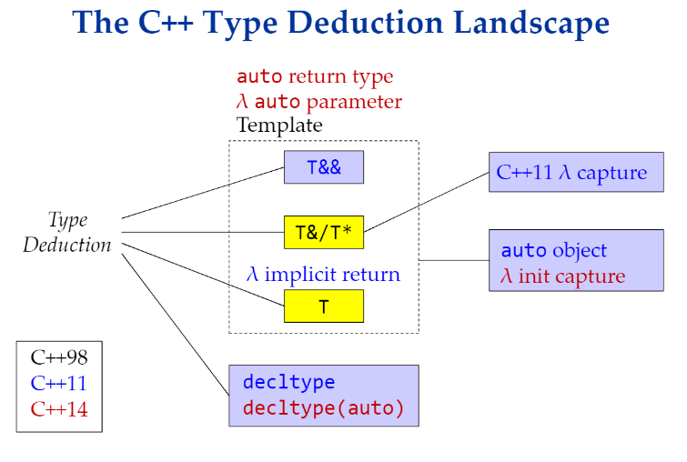
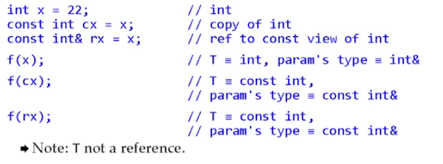
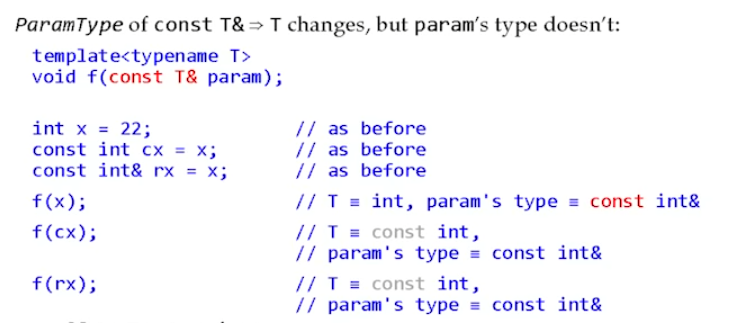
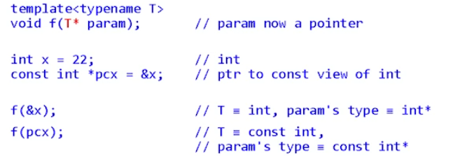
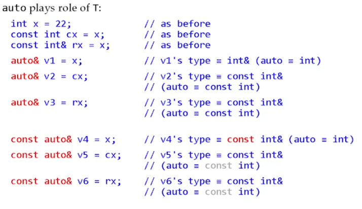
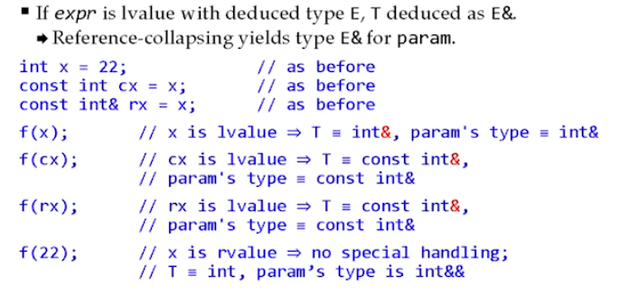
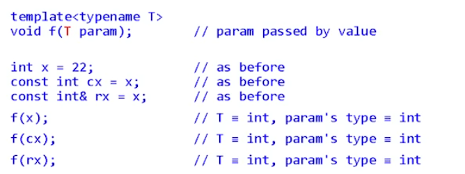

# Type Deduction

*LINK: https://www.youtube.com/watch?v=wQxj20X-tIU*


## Type Deduction in C++ 11




## Template Type Deduction ( auto uses the same rules)

```cpp
template <typename T>
void f(ParamType param);
f(expr)
```

There are three general cases:

### 1. *ParamType* is a reference or pointer, but not a universal reference (most used cases)

- if expr's type is a reference, ignore that
- pattern - matching

**Pass by Reference**
```cpp
template<typename T>
void f(T& param)
```


**Pass by Reference with const**
```cpp
template<typename T>
void f(const T& param)
```


**Pass by Reference pointer**
```cpp
template<typename T>
void f(const T* param)
```


**Auto Rules**




### 2. *ParamType* is a universal reference

```cpp
template<typename T>
void f(const T&& param)
```



### 3. *ParamType* is neither reference nor pointer (By Value)
```cpp
template<typename T>
void f(const T param)
```




Note: we are creating a new object, so the `const` does not matter, and the reference `&` does not matter any more.


- `auto` is the same rule (not `auto&` or `auto&&`) - creating a new variable
- `auto` itself will never become reference

- `auto&` by reference template type deduction 