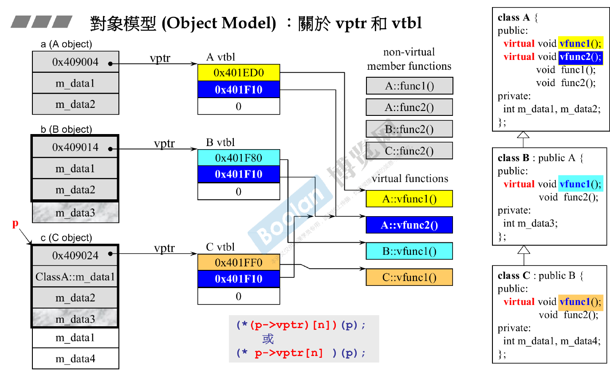

# Virtual Function

## Example:
```cpp
#include <iostream>

// Base class
class Shape {
public:
    virtual void draw() const {
        std::cout << "Drawing a shape." << std::endl;
    }

    virtual ~Shape() {
        std::cout << "Delete Base" << std::endl;
    }  // Virtual destructor
};

// Derived class 1
class Circle : public Shape {
public:
    void draw() const override {
        std::cout << "Drawing a circle." << std::endl;
    }
    ~Circle() {
        std::cout << "Delete Circle" << std::endl;
    }
};

// Derived class 2
class Square : public Shape {
public:
    void draw() const override {
        std::cout << "Drawing a square." << std::endl;
    }
};

int main() {
    Shape* shape1 = new Circle();
    Shape* shape2 = new Square();

    shape1->draw();  // Outputs: Drawing a circle.
    shape2->draw();  // Outputs: Drawing a square.

    delete shape1; 
    // Outputs: Delete circle.
    // Outputs: Delete Base.
    delete shape2;
    // Outputs: Delete Base.

    return 0;
}

```

## V-Ptr

- When there are virtual functions in a class C, There will a V-ptr (4 byte) pointer inside the data structure.
- Derived class has all member functions of Based class

## V-Table

V-Ptr points to V-Table



Each class has it's own virtual table.


## Dynamic Dispatch:
```cpp
#include <iostream>

// Base class
class Animal {
public:
    virtual void makeSound() const {
        std::cout << "Animal makes a sound." << std::endl;
    }
};

// Derived class
class Dog : public Animal {
public:
    void makeSound() const override {
        std::cout << "Dog barks." << std::endl;
    }
};

// Another derived class
class Cat : public Animal {
public:
    void makeSound() const override {
        std::cout << "Cat meows." << std::endl;
    }
};

int main() {
    Animal* animalPtr;  // Base class pointer

    Dog myDog;
    Cat myCat;

    // Dynamic dispatch in action
    animalPtr = &myDog;
    animalPtr->makeSound(); // Output: Dog barks.

    animalPtr = &myCat;
    animalPtr->makeSound(); // Output: Cat meows.

    Cat *myCat2 = new Cat;
    animalPtr = myCat2;
    animalPtr->makeSound(); // Output: Cat meows.
    
    delete myCat2;
    animalPtr->makeSound(); // Seg Fault

    return 0;
}
```


## Functions cannot be virtual

- Static Member Functions: A static member function cannot be virtual because it is not associated with any object. The virtual mechanism works through the object's v-table, and since static member functions have no this pointer, they can't be virtual.

- Constructors: Constructors initialize an object and establish the v-table pointer for virtual functions. Making constructors virtual does not make sense because when the constructor is called, the v-table is not yet set up for the derived class.

- Inline Functions: Technically, an inline function can be declared virtual. However, if an inline function is virtual and is called through a pointer or reference, the inline request is typically ignored. This is because the function call needs to be resolved at runtime, making inline optimization counterproductive.

- Friend Functions: Friend functions are not member functions of a class, and thus cannot be marked as virtual. They don't have a this pointer and are not part of the class's v-table.

- Final Functions: In C++11 and later, you can specify a function as final, which means that the function cannot be overridden in derived classes. A final function is implicitly not virtual, although it could be an override of a virtual function in a base class. Once a function is marked final, it cannot be made virtual in derived classes.

- Private Pure Virtual Functions: While they can technically be declared, they are generally not useful as virtual functions because derived classes cannot access them to provide an implementation. However, this is more of a design consideration rather than a strict rule.

- Constexpr functions: A constexpr function in C++ is intended to be evaluated at compile-time, meaning that it can be used in contexts that require compile-time constants, like array sizes or template arguments. Because constexpr functions are resolved at compile-time, they cannot be declared as virtual.


## V-table initialization

1. v-table Initialization: When an object of a class with virtual functions is created, the v-table for that class is set up first. This table contains pointers to the virtual functions defined in the class.

2. Constructor Execution: After the v-table is initialized, the constructor of the class is called. This order ensures that if any virtual functions are called within the constructor, they refer to the correct implementations as per the current class's v-table.

3. Derived Class Construction: In the case of derived classes, the v-table is updated to point to the virtual functions of the derived class as the constructor of each derived class is called. This ensures that the virtual function calls are directed to the right implementations corresponding to the level of the class hierarchy being constructed.

This mechanism is a part of C++'s runtime type identification and is essential for polymorphic behavior, particularly when constructors or destructors call virtual functions.